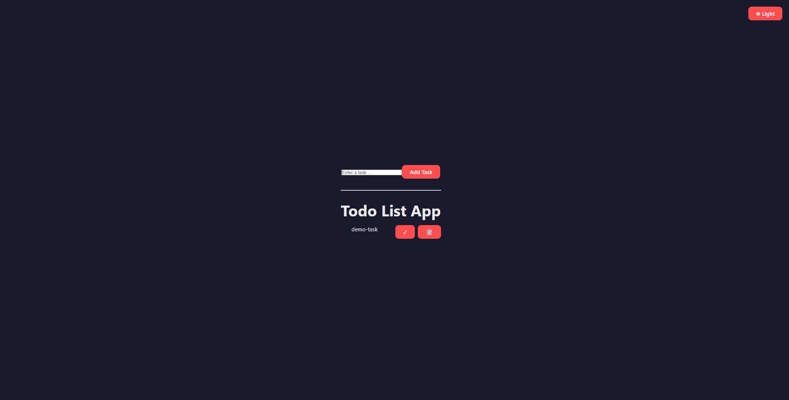

# 📝 Redux Todo List App

  
  
  
  

A **modern, feature-rich Todo List application** built with **React**, **Redux Toolkit**, and **Vite**.  
Designed to demonstrate **clean state management**, **UX feedback with sounds**, and **theme toggling**.

🔗 **GitHub Repository**  
https://github.com/Shweta-rani05/Redux-todo-list-app

## ✨ Features

- ➕ Add tasks (supports **long, multi-line tasks**)
- ✅ Mark tasks as done (✓ with sound)
- 🗑 Delete tasks (different sound)
- 🎉 Celebration sound when **all tasks are completed**
- 🌞🌙 Light / Dark mode toggle
- 🔊 Audio feedback for user actions
- 📱 Responsive & clean UI
- ⚛️ Powered by Redux Toolkit

---

## 🧠 Tech Stack

| Technology       | Purpose                  |
|------------------|--------------------------|
| React            | UI Library               |
| Redux Toolkit    | State Management         |
| Vite             | Development / Build Tool |
| CSS              | Styling & Theming        |
| GitHub           | Version Control          |

---

## 📸 App Screenshots

| 🌞 Light Mode | 🌙 Dark Mode |
|--------------|-------------|
|  |  |

Project Structure :

redux-todo-list-app/
├─ assets/
│   ├─ light.png
│   ├─ dark.png
│   └─ demo.gif
├─ public/
│   ├─ done.mp3
│   ├─ delete.mp3
│   └─ celebrate.mp3
├─ src/
│   ├─ components/
│   │   ├─ Todo.jsx
│   │   ├─ AddForm.jsx
│   │   └─ Todo.css
│   ├─ features/
│   │   └─ todo/todoSlice.js
│   ├─ app/store.js
│   ├─ App.jsx
│   └─ main.jsx
├─ package.json
├─ vite.config.js
└─ README.md

🔮 Future Enhancements : 

 Persist todos using LocalStorage
 Edit tasks
 Task priority & categories
 Confetti animation on completion
 Sound mute toggle

